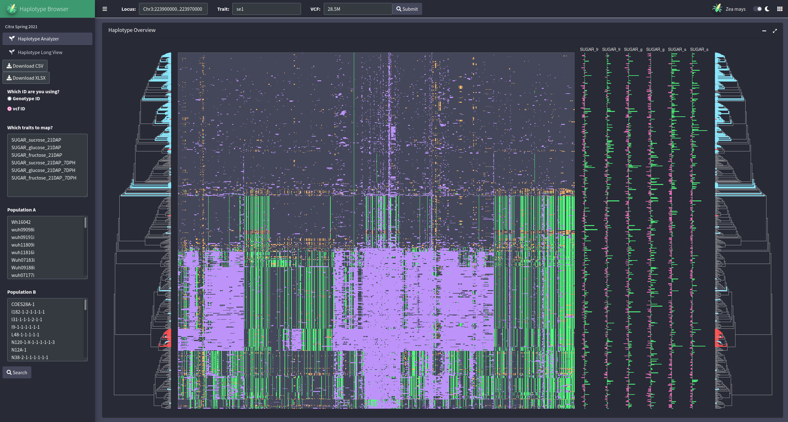
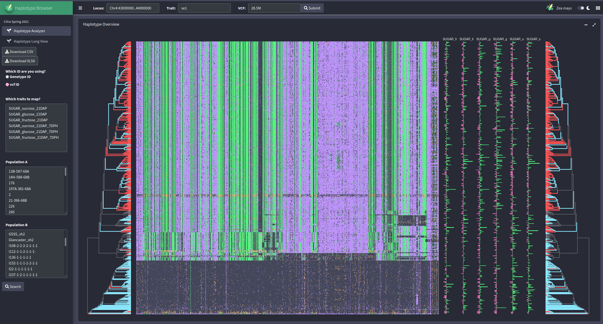
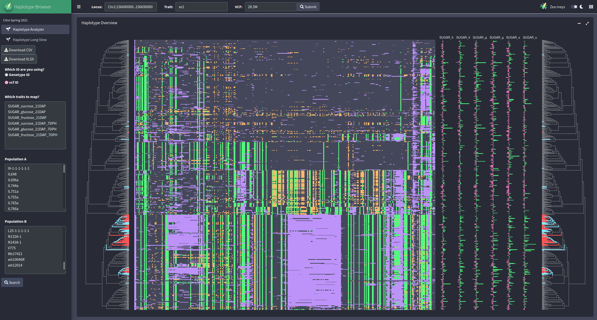

# HaplotypeAnalyzer
A shiny app for haplotype analysis in a diverse population of sweet corn

This app allows you to input a location on the Ia453-sh2 sweet corn genome and will perform clustering and plotting of the haplotypes at that locus. Additionally, accession IDs can be input to color populations and phenotypes can be input to plot alongside the haplotypes to visualize and mine associations. Below are screenshots of different loci.

Haplotype analysis of shrunken2 in the sweet corn diversity population. Gray is ref allele, green is alternate allele, orange is heterozygote, and purple is missing (with high enough depth missing is likely an SV - particularly in the se1 allele)

Haplotype analysis of sugary1 in the sweet corn diversity population

Haplotype analysis of sugary enhancer1 in the sweet cap population

